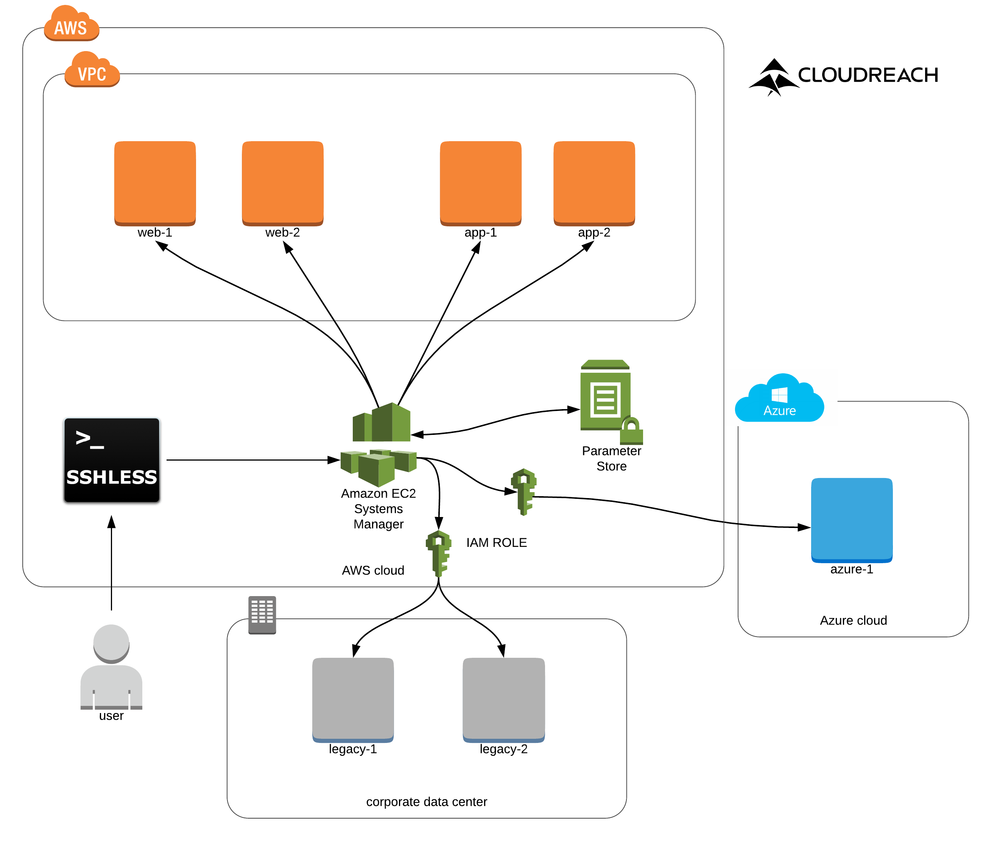

====
DEMO
====

Overview
--------

The demo is required to use Terraform to bootstrap the full scenario composed by:

- 2 EC2 instances with the tag Role=web
- 2 EC2 instances with the tag Role=app
- 2 EC2 instances with the tag Role=legacy to simulate two OnPrem Virtual Machine
- 1 SSM parameter Store entry
- 3 IAM Roles
- 1 Security Group
- 1 VPC, 2 Public Subnet

Diagram
*******

Let's start
-----------

to bootstrap the scenario run the following commands
::

  $ cd test/terraform/
  $ ./run.sh apply
  .....

to execute command on instances with ``tag:Role=web``
::

  $ ./run.sh web
  + sshless cmd -f tag:Role=web 'wget -q -O - http://169.254.169.254/latest/dynamic/instance-identity/document'
  [Success] i-0681b64d16c5039b9 ip-10-0-28-176.eu-central-1.compute.internal
  {
    "devpayProductCodes" : null,
    "marketplaceProductCodes" : null,
    "availabilityZone" : "eu-central-1b",
    "version" : "2017-09-30",
    "region" : "eu-central-1",
    "instanceId" : "i-0681b64d16c5039b9",
    "billingProducts" : null,
    "instanceType" : "t2.micro",
    "privateIp" : "10.0.28.176",
    "pendingTime" : "2018-02-19T15:23:26Z",
    "accountId" : "111111111111",
    "architecture" : "x86_64",
    "kernelId" : null,
    "ramdiskId" : null,
    "imageId" : "ami-5652ce39"
  }
  [Success] i-0b17d5f281971ae1c ip-10-0-29-140.eu-central-1.compute.internal
  {
    "availabilityZone" : "eu-central-1b",
    "devpayProductCodes" : null,
    "marketplaceProductCodes" : null,
    "version" : "2017-09-30",
    "instanceId" : "i-0b17d5f281971ae1c",
    "billingProducts" : null,
    "instanceType" : "t2.micro",
    "imageId" : "ami-5652ce39",
    "privateIp" : "10.0.29.140",
    "pendingTime" : "2018-02-19T15:23:27Z",
    "accountId" : "111111111111",
    "architecture" : "x86_64",
    "kernelId" : null,
    "ramdiskId" : null,
    "region" : "eu-central-1"
  }

to execute command virtual machine OnPrem
::

    $ ./run.sh legacy
    Onprem: Query using ID (Tags not available) ID: mi-07f7cd55f45a6b585,mi-09c4a25f6c0d1eac7
    + sshless cmd -i mi-07f7cd55f45a6b585,mi-09c4a25f6c0d1eac7 hostname
    [Success] mi-09c4a25f6c0d1eac7
    legacy-1

    [Success] mi-07f7cd55f45a6b585
    legacy-2

to execute command virtual machine Azure
::

    $ ./run.sh azure
    Azure: Query using ID (Tags not available) ID: mi-0566401fcacec9264
    + sshless cmd -i mi-0566401fcacec9264 hostname
    [Success] mi-0566401fcacec9264
    azure-1

to test the integration with Parameter Store
::

  $ ./run.sh parameter
  EC2 reading Parameter Store
  + sshless cmd -f tag:Purpose=sshless 'echo {{ssm:example.parameter}}'
  [Success] i-0b17d5f281971ae1c ip-10-0-29-140.eu-central-1.compute.internal
  I am an SSM parameter

  [Success] i-0207f41cec6b1678f ip-10-0-31-142.eu-central-1.compute.internal
  I am an SSM parameter

  [Success] i-0681b64d16c5039b9 ip-10-0-28-176.eu-central-1.compute.internal
  I am an SSM parameter

  [Success] i-03a92bd70a15713ec ip-10-0-30-236.eu-central-1.compute.internal
  I am an SSM parameter

  + set +x
  OnPrem reading Parameter Store
  Query using ID (Tags not available on prem) ID: mi-07f7cd55f45a6b585,mi-09c4a25f6c0d1eac7
  + sshless cmd -i mi-07f7cd55f45a6b585,mi-09c4a25f6c0d1eac7 'echo {{ssm:example.parameter}}'
  [Success] mi-09c4a25f6c0d1eac7
  I am an SSM parameter

  [Success] mi-07f7cd55f45a6b585
  I am an SSM parameter

to delete everything
::

  $ cd test/terraform/
  $ ./run.sh destroy
  .....
